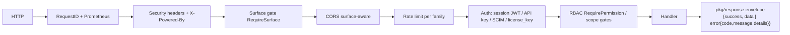

# Architecture

HiTechCloud Keygate is a single Go binary (Gin + Bun ORM / PostgreSQL 18) that
serves a JSON API and the embedded React SPA from one process. No
microservices, no required Redis, no message broker — background work runs in
goroutines inside the same binary (`cmd/server/main.go` wires them all).

## Module layout

| Path | Contents |
|---|---|
| `cmd/server/` | The server binary: config load, migrations, service wiring, route table, background loops, SPA serving. |
| `internal/handler/` | HTTP layer (Gin handlers). One file family per domain: `admin.go`, `license.go`, `marketplace_public.go`, `order_admin.go`, `payment_gateway.go`, `sso_auth.go`, … |
| `internal/service/` | Business logic: `license.go`, `usage.go`, `entitlement.go`, `order.go`, `email.go`, `webhook.go`, `config_service.go`, `retention.go`, `release*.go`. |
| `internal/store/` | Bun ORM persistence. `store.New(dsn)` owns `*bun.DB`. Table access is split by domain (`orders.go`, `coupons.go`, `plan_prices.go`, `affiliates.go`, …). |
| `internal/model/` | Row models + pure domain logic (status vocabularies, validation, math helpers). |
| `internal/payment/` | Payment providers: Stripe (subscriptions + one-time) and the Vietnamese gateways Pay2S / ZaloPay / payOS (`internal/payment/provider.go` registry). |
| `internal/license/` | License key generation (`GenerateKey`) and hashing. |
| `internal/money/`, `internal/coupon/`, `internal/tax/` | Std-lib-only pricing engines. **Money is int64 minor units** (ISO-4217 exponent table; VND exponent 0 = whole dong). Never floats. |
| `internal/middleware/` | RequestID, Prometheus metrics, surface enforcement, CORS, rate limiting (memory + optional Redis), session/API-key auth, RBAC gates, idempotency, brute-force guard. |
| `internal/surface/` | The multi-domain surface router (see below). |
| `internal/config/` | Env bootstrap + the 71-key configuration catalog (`keys.go`). |
| `internal/crypto/` | AES-GCM license-key encryption (HKDF subkeys) and `SecretBox` sealed secrets (`enc:v1:`). |
| `internal/events/` | In-process event hub: lifecycle events fan out to the notification inbox and customer webhooks. |
| `internal/sso/` | SAML / OIDC assertion verification and SCIM user mapping. |
| `internal/branding/` | The **"Powered by Keygate"** attribution constants (AGPL v3 §7(b) — see `docs/LICENSE-COMPLIANCE.md`). |
| `pkg/response/`, `pkg/apperr/` | The response envelope and typed application errors. |
| `web/` | React 19 + Vite + TypeScript SPA (admin, portal, marketplace, checkout). |
| `db/migrations/` | Ordered `*.up.sql` / `*.down.sql` pairs, applied automatically at boot. |
| `scripts/` | `seed/` (demo data), `load/` (k6), `e2e/` (smoke scripts). |

## Request flow



Notable wiring points in `cmd/server/main.go`:

- `r.RedirectTrailingSlash = false` — a trailing slash answers the JSON 404
  envelope instead of an HTML redirect.
- Trusted proxies: RFC1918 + `fc00::/7`; client IP comes from
  `X-Forwarded-For` / `X-Real-Ip`.
- Every response carries the `X-Powered-By` attribution header plus
  `X-Frame-Options`, `X-Content-Type-Options`, `X-XSS-Protection`,
  `Referrer-Policy`, and HSTS when `BASE_URL` is HTTPS.
- `r.NoRoute` answers `{"success":false,"error":{"code":"NOT_FOUND",…}}` —
  unknown API paths never return gin's plain-text 404.

## Embedded SPA

`serveFrontend(r)` installs a middleware that serves the built SPA from
`web/dist` (when present): non-API paths get `index.html` (client routing),
`/assets/*` and known static extensions get immutable files. The following
prefixes always fall through to the API router: `/api/`, `/pay/`, `/health`,
`/metrics`, `/docs`. Missing static files are 404s — never the app shell — so
a browser reloads rather than rendering stale JS under a wrong URL.

## Surface routing (5-domain split)

`internal/surface` models the install as named host surfaces. With
`domain.base` configured, `DeriveFromBase` derives the standard five plus
apex; `domain.<surface>` settings override any of them individually. Optional
extra surfaces exist for hooks, docs, status, go, auth and cdn (12 total).

| Surface | Typical host | Route groups (`cmd/server/main.go`) |
|---|---|---|
| `payments` | payments.example.com | `/pay/:checkout_id`, `/checkout/*`, `/webhook/*` |
| `dashboard` | dashboard.example.com | `/api/v1/setup/*`, all `/api/v1/admin/*` |
| `merchant` | merchant.example.com | `/api/v1/portal/*` (shared with customer) |
| `customer` | customer.example.com | `/api/v1/portal/*`, `/api/v1/auth/*`, `/invites/accept`, SSO endpoints |
| `verify` | verify.example.com | `/api/v1/license/*`, `/api/v1/marketplace/*`, developer API (`/me`, `/orders`, `/licenses`), `/scim/v2/*`, `/affiliates/convert` |
| `apex` | example.com | `/r/:code` (affiliate redirect) |

Shared on every host: `/health`, `/metrics`, `/api/v1/config`,
`/api/v1/site-config`, `/api/v1/version`, `/docs`.

`middleware.RequireSurface` **enforces** the mapping only when at least one
domain is configured — single-host installs and localhost dev behave exactly
as before. A wrong host gets 404 (API) or a 302 to the canonical host with the
query preserved (browser, `X-Forwarded-Host` respected).
`middleware.CORS(surfCfg, baseURL)` is surface-aware the same way.

## Configuration: config-in-DB

Runtime configuration lives in the `settings` table. `internal/config/keys.go`
is the static catalog: **71 keys** in 10 categories (app, payment, smtp,
domains, ratelimit, webhook, retention, storage, observability, branding),
each with type, legacy env var, default and restart-required flag.

Precedence (enforced by `service.ConfigService`):

```text
stored settings row  >  env var  >  catalog default
```

with the refinement that a stored row still equal to the catalog default
counts as **unset**, so an env var an upgrading install relies on is not
shadowed. Non-secret values are cached for 30 s; secrets are never cached and
are stored sealed (`enc:v1:` — AES-256-GCM under an HKDF subkey of
`SECRET_ENCRYPTION_KEY`, see `internal/crypto/secretbox.go`). The admin API is
`GET/PUT/PATCH /api/v1/admin/config`, `DELETE /api/v1/admin/config/:key`,
`POST /api/v1/admin/config/:key/reset` (permission `settings.manage`; secret
values are masked in every response).

**Bootstrap env vars (never in the catalog):** `PORT`, `DATABASE_URL`,
`JWT_SECRET`, `LICENSE_SIGNING_KEY`, `SECRET_ENCRYPTION_KEY`,
`RELEASE_KEY_ENCRYPTION_KEY`, `REFERRAL_HASH_SALT`, `REDIS_URL`.

**Boot overlay vs live seams.** At boot, `ConfigService.ApplyBootOverlay`
copies effective values onto the runtime `config.Config` for every key with a
boot-time consumer (rate limits, brute-force, webhook, storage, SMTP, quota,
Stripe, `observability.log_level`), so the settings table wins over the
environment without any code reading env directly. Keys marked
restart-required apply at the next boot; the live-scoped keys (payment gateway
credentials, domains, `session_cookie_domain`, retention, branding, SMTP
delivery) are re-read per use and take effect immediately. A key explicit in
neither the database nor the environment leaves the env-loaded value alone.

`.env.example` is the complete environment reference: every catalog env var
and bootstrap var is documented there, and `internal/config/env_example_test.go`
fails the build if the two ever drift apart.

## Email queue

Outbound mail is queued into `email_queue` (`store.EnqueueEmail`), processed in
batches of 20 by `EmailService.StartEmailQueueProcessor`. If SMTP is not
configured, mail degrades to log output (OTP codes still reach developers).
A `notifications` row deduplicates reminder emails per (license, tag) so a
crash-and-retry loop cannot spam customers.

## Webhook pipeline

Two webhook systems share one delivery engine (`internal/service/webhook.go`):

- **Merchant webhooks** (`webhooks` + `webhook_deliveries`) — managed from the
  admin console.
- **Customer webhooks** (`customer_webhooks`) — self-service in the portal,
  secret returned once at creation (sealed at rest).

Deliveries are signed with `X-HiTechCloud-Event`, `X-HiTechCloud-Signature:
sha256=<hex HMAC-SHA256 of the body>` and a fresh `X-HiTechCloud-Delivery` id.
The retry loop drains pending deliveries (`WEBHOOK_MAX_ATTEMPTS`, default 5;
`WEBHOOK_RETRY_INTERVAL`, default 30 s). Deliveries can be resent, replayed
byte-identically (`X-HiTechCloud-Replay`), and secrets rotated.

The `internal/events` hub fans lifecycle events (the 19-event vocabulary —
`model.CustomerWebhookEvents`) into the in-app notification inbox and the
customer webhook dispatcher in parallel, best-effort, with panic isolation.

## Background loops (all in `cmd/server/main.go`)

| Loop | Cadence | Purpose |
|---|---|---|
| Webhook retry | 30 s | Deliver pending webhook rows. |
| Floating cleanup | 1 min | Expire idle floating sessions. |
| Expiry checker | hourly ticker | Expiry / grace transitions, reminders, `license.expired`. |
| Metered sync | 5 min | Push usage counters to Stripe billing meters. |
| Email queue | continuous | Drain `email_queue`. |
| Hourly cleanup | 1 h | Expired OTPs, past-expiry refresh tokens, idempotency keys, **retention sweep** (90/30/90/365 d). |
| Stripe checkout sync | 5 min | Heal missed webhooks; cancel-state sync. |
| Analytics snapshot | 24 h | Daily rollups for the analytics pages. |

## Related docs

`docs/API.md` · `docs/DATABASE.md` · `docs/SECURITY.md` ·
`docs/DEPLOYMENT.md` · `docs/MULTI-TENANCY.md` (planned work)
